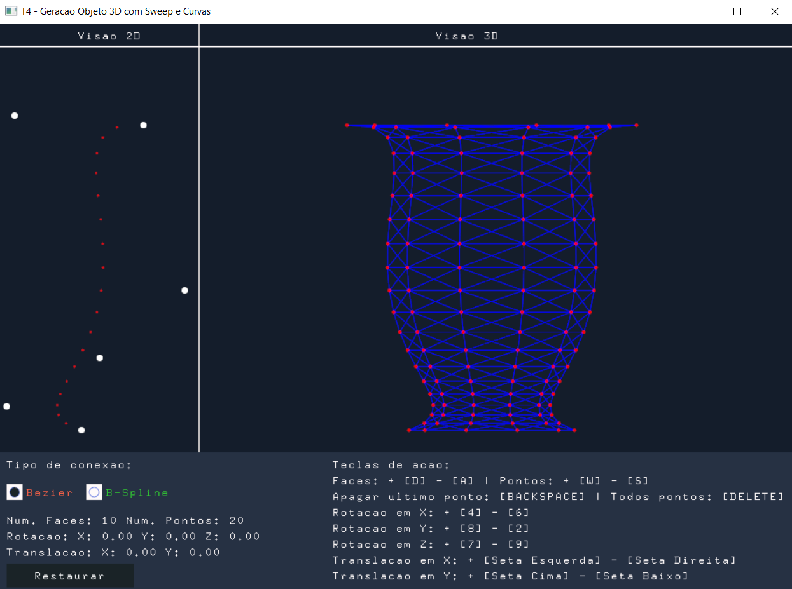

# Geração de Objeto 3D com Sweep e Curvas

- Nome: Juliano Leonardo Soares
- Matricula: 201713854

    

## Descrição:
Um programa para fazer modelagem e visualização 3D de objetos gerados com sweep
rotacional e curvas de Bezier.

## Manual de Uso:
Basta abrir a plicação executar o main junto com as bibliotecas necessaria para rodar o canvas2d. As telcas de ação estão descritas na interface do programa.
 
## Implementações:

### Básico:
- [x] Conexão entre pontos com curva Bézier
- [x] Conexão entre pontos com curva B-spline 4 pontos de controle
- [x] Visualização ortográfica e perspectiva (sob vários ângulos) em wiframe, com uso de triângulos
- [x] Parametrização do número de pontos e faces do objeto gerado 
- [x] Rotacionar
- [X] Transladar
### Extras:
- [x] Adição de mais de 4 pontos de controle
- [ ] Poder ativar/desativar o preenchimento os triangualos (Foi feito mas travou de mais kkk)
- [ ] Poder ativar/desativar ponto de luz
- [ ] Exibir vetores normais em cada face
- [ ] Adição de mais de uma patch
- [ ] Remoção de faces ocultas - sem preenchimento
- [ ] Preenchimento de polígonos
  - [ ] com iluminação por vértice
  - [ ] com iluminação por pixel

### Melhorias a fazer:
- [ ] Terminar de implementar as tarefas extras
- [ ] Gerar outras formas de conexao entre os pontos 
- [ ] Utilizar textura 
- [ ] E melhorar a performance

OBS: Para desenhar a B-Spline é necessário somente 4 pontos de controle, por isso se você tiver menos de 4 pontos irá aparecer uma mensagem no terminal avisando, e se você tiver com mais de 4 pontos o programa automaticamente apaga os últimos pontos adicionados até sobrar somente os 4 pontos primeiros pontos. Há um pequeno problema ao apagar os pontos durante o render da B-Spline que fica resquícios dos pontos anteriores, este problema não foi resolvido até então por falta de tempo.